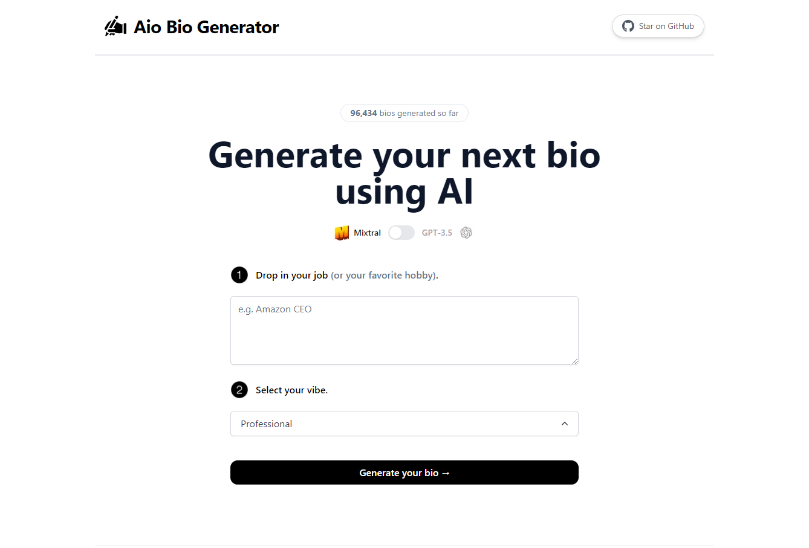

# [BioGenerator](https://www.twitterbio.io/)

This project generates Twitter (X) / Facebook / Instagram  bios for you using AI.

## How it works

In order to generate a  bio, this project leverages the capabilities of both Mixtral and GPT-3.5, along with streaming functionality. It creates a prompt using user input and form, and then sends this prompt to either the Mixtral API via Together.ai or the GPT-3.5 API via OpenAI. The resulting response is then streamed back to the application.

## Running Locally

1. Create an account at [OpenAI](https://beta.openai.com/account/api-keys) and add your API key under `OPENAI_API_KEY` in your `.env`
2. Create an account at [Together.ai](https://www.together.ai/) and add your API key under `TOGETHER_API_KEY`
3. Run the application with `npm run dev` and it will be available at `http://localhost:3000`.

## One-Click Deploy

Deploy the example using [Vercel](https://vercel.com?utm_source=github&utm_medium=readme&utm_campaign=vercel-examples):

